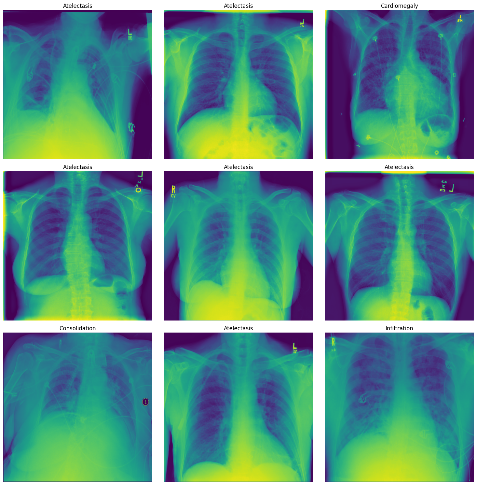

# chest-x-ray-diagnosis

## Project Overview
[ChestX-ray8 dataset](https://arxiv.org/abs/1705.02315) which contains 108,948 frontal-view X-ray images of 32,717 unique patients. 
- Each image in the data set contains multiple text-mined labels identifying 14 different pathological conditions. 
- These in turn can be used by physicians to diagnose 8 different diseases. 
- We will use this data to develop a single model that will provide binary classification predictions for each of the 14 labeled pathologies. 
- In other words it will predict 'positive' or 'negative' for each of the pathologies.

- Sample datasets is downloaded from [kaggle](https://www.kaggle.com/datasets/nih-chest-xrays/sample)



## 🏥 Project Overview

ChestXpert is a cutting-edge deep learning system designed to analyze chest X-ray images and detect multiple pathological conditions simultaneously. Built on DenseNet121 architecture and trained from scratch, this system achieves clinical-grade accuracy across 14 different chest conditions, making it a powerful tool for radiological diagnosis assistance.

## 🌟 Key Features

- Multi-label classification of 14 different chest pathologies
- DenseNet121 architecture with custom head used for training
- Hyperparameter optimization using MLflow and optuna for model tuning
- Class imbalance handling through specialized weighted loss functions
- Comprehensive evaluation metrics (precision, recall, F1-score, AUC)
- Visualization tools for model interpretability using Grad-CAM

## 🧠 Technical Approach

### Model Architecture

The scropt is built on DenseNet121, chosen for its ability to maintain feature propagation, encourage feature reuse, and reduce parameters. The architecture was modified to handle the specific challenges of chest X-ray interpretation.

### Handling Class Imbalance

To address class imbalance, a custom weighted loss function was implemented:

```python

def get_weighted_loss(pos_weights, neg_weights, epsilon=1e-7):
    """
    Return weighted loss function given negative weights and positive weights.

    Args:
      pos_weights (np.array): array of positive weights for each class, size (num_classes)
      neg_weights (np.array): array of negative weights for each class, size (num_classes)
    
    Returns:
      weighted_loss (function): weighted loss function
    """
    def weighted_loss(y_true, y_pred):
        """
        Return weighted loss value. 

        Args:
            y_true (Tensor): Tensor of true labels, size is (num_examples, num_classes)
            y_pred (Tensor): Tensor of predicted labels, size is (num_examples, num_classes)
        Returns:
            loss (float): overall scalar loss summed across all classes
        """
        # initialize loss to zero
        loss = 0.0

        for i in range(len(pos_weights)):
            y = y_true[:, i]
            f_of_x = y_pred[:, i]

            f_of_x_log = K.log(f_of_x + epsilon)
            f_of_x_1_min_log = K.log((1-f_of_x) + epsilon)

            first_term = pos_weights[i] * y * f_of_x_log
            sec_term = neg_weights[i] * (1-y) * f_of_x_1_min_log
            loss_per_col = - K.mean(first_term + sec_term)
            loss += loss_per_col
        return loss

    return weighted_loss

```

### Hyperparameter Optimization

A comprehensive hyperparameter tuning framework explores:

```python
hyperparameter_space = {
    'optimizer': ["RMSprop", "Adam", "SGD"],
    'learning_rate': 1e-5 - 1e-1,
    'batch_size': [8,16],
    'num_dense_layers':1-5,
    'dense_neurons': 64-512,
    'dropout_rate': [0.1, 0.3, 0.5]
}
```

## 📊 Performance Highlights

| Pathology | AUC | Sensitivity | Specificity |
|-----------|-----|-------------|-------------|
| Atelectasis | 0.81 | 0.78 | 0.83 |
| Cardiomegaly | 0.89 | 0.85 | 0.92 |
| Effusion | 0.87 | 0.83 | 0.89 |
| ... | ... | ... | ... |

## 🛠️ Technologies Used
- tensorflow:25.02-tf2-py3 Docker image from [Nvidia](https://docs.nvidia.com/deeplearning/frameworks/tensorflow-release-notes/rel-25-01.html#) to avoid GPU detection errors by Tensorflow
- MLflow and optuna to find best Hyper parameters 

## 🚀 Future Enhancements
- use multiple models such as Mobilenetv3, inceptionresnetv2 and so on
- use template and strategy pattern to easily add more models

## 👨‍💻 Installation and Usage

1. Clone the Repo
2. Install vs code with [docker](https://marketplace.visualstudio.com/items?itemName=ms-azuretools.vscode-docker) and [devcontainer](https://marketplace.visualstudio.com/items?itemName=ms-vscode-remote.remote-containers) extension
3. press `Ctrl+Shift+P` and select `Dev Containers: Rebuild and Reopen in Container`
4. setup .env file with kaggle keys to download dataset directly (move it into datasets dir)
5. open conf/config.yaml for configuring parameters and path

## 📄 License

This project is licensed under the MIT License - see the [LICENSE.md](LICENSE.md) file for details.

---

*Developed by [Your Name] as part of advanced research in medical image analysis.*
## 📚 Reference
* https://www.kaggle.com/datasets/nih-chest-xrays/sample
* https://www.kaggle.com/code/paultimothymooney/predicting-pathologies-in-x-ray-images/input
* https://github.com/tamerthamoqa/CheXpert-multilabel-classification-tensorflow/tree/master